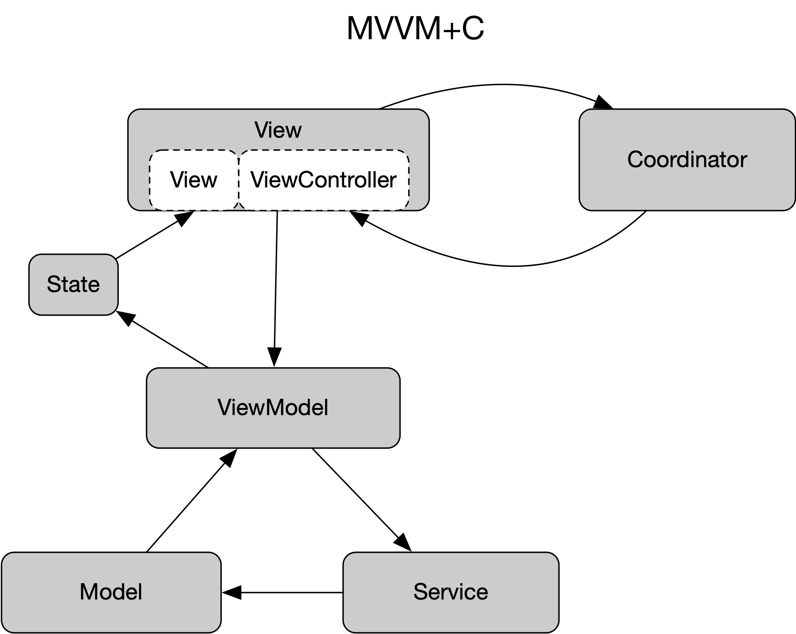

# PlanningPoker
Simple example of an MVVM+C implementation.

## Project Goals

1. Create a non trivial app using MVC as given by apple.  Build up "massive view controllers" or at least tightly coupled.  They should have the following inside each UIViewController:
    - Model/Business
    - Navigation/Routing
    - Networking
2. Refactor logic item by time towards a goal of MVVM+C.  Each iteration should have:
    - An [issue associated](https://github.com/ethyreal/PlanningPoker/issues) with it
    - Issues can serve as a kind of dev diary
3. Polish well factored POC into a fully functioning MVP of Planning Poker
4. Explore evolving this archetecute towards a desclarive and reactive paradigm using Combine and SwiftUI
5. Make the case for MVVM as a prefered transitional design pattern that is useful for a UIKit world and later for a SwiftUI world

### What is MVVM?

> The Model-View-ViewModel (MVVM) pattern helps to cleanly separate the business and presentation logic of an application from its user interface (UI)
- [Microsoft Docs](https://docs.microsoft.com/en-us/xamarin/xamarin-forms/enterprise-application-patterns/mvvm)

### Why?

Strengths of using this pattern primarily are:

- Separation of concerns
- Easy to reason about
- Testability

### How is this done in UIKit?

- Model: Struct/Class 
- View: UIView(Controller) 
- ViewModel: Class

### But really it should be written:

Model <-> ViewModel <-> View

The Model and View never actually talk to each other.

We can use a `State` type to represent a view's ... well state.  This creates a unidirectional data flow for UI updates:

`Model -> ViewModel -> State -> View`.  

There is also a parallel flow that handles updates or actions from the user in the view:

`View -> ViewModel -> Service -> Model`

An illustration of these data flows:

